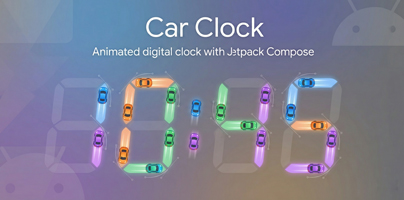

#  Car Clock

A unique, highly customizable digital clock for Android where animated cars form the segments of each number, built entirely with Jetpack Compose.

---

  <!-- TODO: Add a project banner image or GIF here -->
  

## Overview

This application is a creative exploration of advanced animation in Jetpack Compose. It transforms a standard digital display into a dynamic scene where cars drive along smooth, configurable Bézier curve paths to form numbers. The project showcases a clean separation of logic and UI, a responsive layout system, and a powerful, centralized configuration for complex animations.

## Features

-   **Animated Digital Display**: Numbers transition smoothly as cars drive in and out of place to form the segments of a 7-segment display.
-   **Fully Configurable Animation Paths**:
    -   Define unique animation paths for every possible digit transition (e.g., from '8' to '7').
    -   Control path shapes using **Straight Lines**, **Quadratic Curves** (1 control point), or **Cubic Bézier Curves** (2 control points).
    -   Specify custom control points using relative `(x, y)` offsets for complete artistic freedom.
-   **Dynamic "Default" Curve Logic**: When a custom path isn't defined, the system intelligently generates a smooth S-curve that respects the car's real-time orientation, preventing unnatural rotations.
-   **Responsive Layout**: All visual elements, including the cars, grid size, and off-screen "garage" positions, scale proportionally based on screen width and height.
-   **Interactive Debug Mode**: Manually increment and decrement digits to test specific transitions and choreographies.
-   **Customizable Second Hand**: Includes multiple second-hand designs, from a simple line to a car driving around a rounded-rectangular path, demonstrating different animation techniques.

## Tech Stack

-   **Language**: **Kotlin**
-   **UI Framework**: **Jetpack Compose (Material3)**
-   **Animation**: Compose Animation API (`Animatable`, `Tween`, `LaunchedEffect`)
-   **Architecture**:
    -   Stateful "Controller" composables managing stateless "UI" composables.
    -   Singleton objects for managing shared state (`RotationState`).
    -   Centralized `TransitionConfig` for animation choreography.

## How it Works

1.  **7-Segment Display**: The app maps each digit (0-9) to a standard 7-segment layout. Seven `Car` composables are used to represent these segments.
2.  **Centralized State (`RotationState`)**: A singleton object tracks the last known rotation of each car. This is crucial for ensuring smooth transitions without unwanted visual "flips" at the start of an animation.
3.  **Flexible Path Definition**: For any digit change (e.g., from `0` to `1`), the app checks a central `TransitionConfig` file.
    -   If a manual path is defined (with 0, 1, or 2 control points), the car follows that exact path (straight, quadratic, or cubic).
    -   If `useDefaultCurve` is enabled, a smart S-curve is generated that respects the car's current rotation.
4.  **Dynamic Garage Positions**: If a car isn't needed for a new digit, it drives to an off-screen "garage." The garage positions are calculated dynamically based on the device's screen height, ensuring they are always out of view on any screen size.
5.  **Responsive Sizing**: The main `DigitalCarNumber` composable calculates a `gridSize` based on its container width. This `gridSize` is then used to proportionally determine the size of the cars, the layout margins, and the path coordinates, making the entire UI responsive.

## Disclaimer

> [!NOTE]
> This project is a personal portfolio piece designed to showcase advanced skills in Kotlin, Jetpack Compose, and custom UI/animation systems.